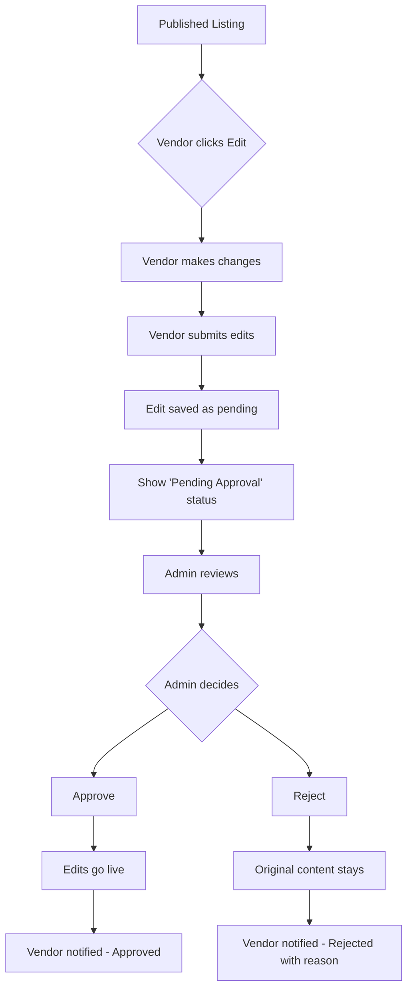

# Edit Approval Feature - Frontend Implementation Plan

## Overview
When a listing is edited after it has been approved and published, the new edits must be approved by an admin before they go live. The old information remains visible until the edits are approved.

## Current Workflow
```
Published Listing → Edit → Changes Applied Immediately → Live
```

## New Workflow
```
Published Listing → Edit → Changes Stored as Pending → Admin Reviews → Approved → Live
                                                       └──→ Rejected → Original Stays Live
```

---

## Frontend Implementation Plan

### 1. New Status States
Add new status types to handle pending edits in the frontend:

**Add to `src/lib/api.ts` or create new types:**
```typescript
type ListingStatus = 
  | "published"      // Live and visible
  | "pending"        // Awaiting initial approval
  | "drafted"        // Not yet submitted
  | "pending_edit"   // Has pending edits awaiting approval
  | "rejected"       // Rejected
  | "suspended";    // Temporarily disabled
```

### 2. API Service Layer Updates
**File: `src/lib/api.ts`**

Add new API functions (assuming backend provides these endpoints):
- `submitEditForApproval(listingSlug: string, editData: any)` - Submit edits as pending
- `getPendingEdits(listingSlug?: string)` - Get pending edits for a listing
- `approveEdit(editId: string)` - Approve pending edit
- `rejectEdit(editId: string, reason?: string)` - Reject pending edit
- `getListingWithPendingEdit(listingSlug: string)` - Get listing with pending edit info

### 3. Vendor Dashboard Changes

#### 3.1 Vendor My Listings Page
**Files:**
- `src/app/dashboard/vendor/my-listing/page.tsx`
- `src/app/dashboard/listing-agent/my-listing/page.tsx`

**Changes:**
- Add "Pending Edits" badge/status indicator for listings with unapproved changes
- Show edit status in listing table
- Disable edit button while pending edit exists (or allow viewing pending edit)
- Add info message explaining edit is under review

#### 3.2 Vendor Edit Form - Review Step
**Files:**
- `src/app/dashboard/vendor/my-listing/edit/form-component/review.tsx`
- `src/app/dashboard/listing-agent/my-listing/edit/form-component/review.tsx`

**Changes:**
- Modify submit action to call `submitEditForApproval` instead of direct update
- Show "Your edits are pending approval" message after submission
- Display comparison view (current vs proposed changes) in review step
- Handle success/error responses appropriately

#### 3.3 Status Display Updates
**File: `src/components/dashboard/listing-table.tsx`**

**Changes:**
- Add visual indicator for "pending_edit" status
- Show when last edit was submitted and is awaiting approval

### 4. Admin Dashboard Changes

#### 4.1 Admin Listings Page
**File: `src/app/dashboard/admin/listings/page.tsx`

**Changes:**
- Add new tab/filter for "Pending Edits"
- Show listings with pending edits in a dedicated section
- Display what fields were changed (diff view if available)

#### 4.2 Edit Approval UI
**Changes to existing admin listing page:**

**Functions to add:**
- `handleApproveEdit(editId: string)` - Approve pending edit
- `handleRejectEdit(editId: string, reason: string)` - Reject with reason
- Update status badge to show pending edit count
- Add quick approve/reject buttons in listing table

#### 4.3 Status Update API Integration
**File: `src/app/dashboard/admin/listings/page.tsx`

**Changes:**
- Integrate with new approve/reject edit endpoints
- Handle success/error states
- Show toast notifications for actions

### 5. Public Listing Display
**File: `src/components/universal-slug-page.tsx`

**Changes:**
- Check if listing has pending edit (from API response)
- Always display current approved content (not pending changes)
- Optionally show "Recently updated" badge after edit is approved

### 6. Notifications
**Using existing toast system (sonner):**

**Features:**
- Toast notification to vendor when edit is approved
- Toast notification to vendor when edit is rejected with reason
- Admin notification when new edit is submitted (if using admin dashboard)

---

## Files to Modify

| File | Changes |
|------|---------|
| `src/lib/api.ts` | Add new API functions for edit approval |
| `src/app/dashboard/vendor/my-listing/page.tsx` | Show pending edit status |
| `src/app/dashboard/listing-agent/my-listing/page.tsx` | Show pending edit status |
| `src/app/dashboard/vendor/my-listing/edit/form-component/review.tsx` | Submit for approval flow |
| `src/app/dashboard/listing-agent/my-listing/edit/form-component/review.tsx` | Submit for approval flow |
| `src/components/dashboard/listing-table.tsx` | Add pending_edit status display |
| `src/app/dashboard/admin/listings/page.tsx` | Add pending edits management |
| `src/components/universal-slug-page.tsx` | Display original content |

---

## Implementation Sequence

### Phase 1: API Layer
1. Add new status types to TypeScript interfaces
2. Create API service functions for edit approval

### Phase 2: Vendor Dashboard Updates
1. Update listing table with pending edit status
2. Modify edit form submission flow (review step)

### Phase 3: Admin Dashboard Updates
1. Add pending edits view/filter
2. Create approval/rejection functionality

### Phase 4: Testing & Polish
1. Test complete flow
2. Add notifications
3. Edge case handling

---

## Mermaid Diagram - New Flow



---

## User Experience Summary

### Vendor Experience
1. Edit listing as normal
2. After clicking "Submit", sees message "Your edits are pending approval"
3. Original content remains live
4. Receives notification when approved or rejected
5. If rejected, can see reason and edit again

### Admin Experience
1. New "Pending Edits" tab in listings dashboard
2. Can view all pending edits
3. Can approve with one click or reject with reason
4. After approval, listing updates automatically

### Public Experience
1. No visible change - sees current approved content
2. After edit approved, sees updated content

---

## Notes

- This plan assumes the backend API will provide endpoints to:
  - Store pending edits separately from published content
  - Retrieve pending edit status for listings
  - Approve/reject pending edits
  - Return pending edit information in listing queries

- The actual implementation should be tested with the backend team to ensure API contracts match
